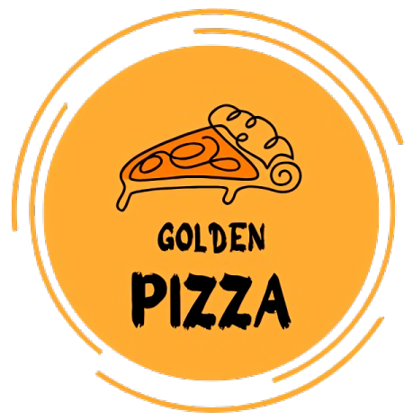

<div align="center">
  

  # Golden Pizza

  **A bilingual pizza ordering website — dark theme, smooth UX, zero dependencies.**

  
  
  
  
  

</div>

---

## Overview

Golden Pizza is a fully client-side pizza ordering experience built with pure HTML, CSS, and JavaScript — no frameworks, no build tools. Visitors browse a live menu, customize their pizza (size, crust, extras), and receive an order summary — all within a polished dark-themed interface that supports both **English** and **Arabic** with automatic RTL layout.

---

## Features

| Feature | Description |
|---------|-------------|
| **Interactive Menu** | Browse all pizzas with photos, names, and prices |
| **Dedicated Order Page** | Customize size, crust, and toppings per pizza |
| **Live Price Calculator** | Total updates in real time as options are selected |
| **Bilingual EN / AR** | Full translation with RTL layout, saved across pages |
| **Instant Search** | Search overlay filters the menu from any page |
| **Order Confirmation** | Summary dialog before the order is finalized |
| **Login UI** | Polished modal login dialog with form validation |
| **Responsive** | Works cleanly on desktop, tablet, and mobile |
| **Dark Theme** | Consistent dark aesthetic with gold accent color |

---

## Pages

| Page | Role |
|------|------|
| `html/mainPage.html` | Home — promo video, menu grid, customer reviews, footer |
| `html/orderPage.html` | Order — size, crust, extras, quantity selector, live checkout summary |

---

## Tech Stack

| Layer | Technology |
|-------|-----------|
| Markup | HTML5 |
| Styling | CSS3 — Flexbox, custom RTL overrides, CSS transitions |
| Logic | Vanilla JavaScript — no libraries or frameworks |
| Icons | [Remix Icons](https://remixicon.com) |
| Fonts | Google Fonts — Cause |

---

## Project Structure

```
Golden-Pizza/
├── html/
│   ├── mainPage.html        # Home page
│   └── orderPage.html       # Pizza customization & checkout
├── css/
│   ├── mainPage.css         # Global styles, RTL overrides
│   └── orderPage.css        # Order page layout & components
├── js/
│   ├── i18n.js              # Translation engine — EN / AR dictionary
│   ├── products.js          # Bilingual product catalogue
│   ├── comments.js          # Bilingual customer reviews
│   ├── main.js              # Home page interactions
│   └── orderPage.js         # Order page interactions
└── media/
    ├── image/               # Pizza photos, logo, rating icon
    └── video/               # Homepage promo video
```

---

## Getting Started

No build step or package manager required.

```bash
# Clone the repository
git clone https://github.com/Fahd070/Golden-Pizza.git
cd Golden-Pizza

# Open directly in your browser
start html/mainPage.html       # Windows
open html/mainPage.html        # macOS
```

> **Tip:** For the best experience use [VS Code Live Server](https://marketplace.visualstudio.com/items?itemName=ritwickdey.LiveServer) or any static file server — this avoids browser restrictions on local video autoplay.

---

## Language Support

Select **English** or **Arabic** from the dropdown in the header. The choice is saved in `localStorage` and persists when navigating between pages. Switching to Arabic automatically activates full RTL layout.

---

<div align="center">
  Made with ❤️ by <a href="https://github.com/Fahd070">Fahd070</a>
</div>
